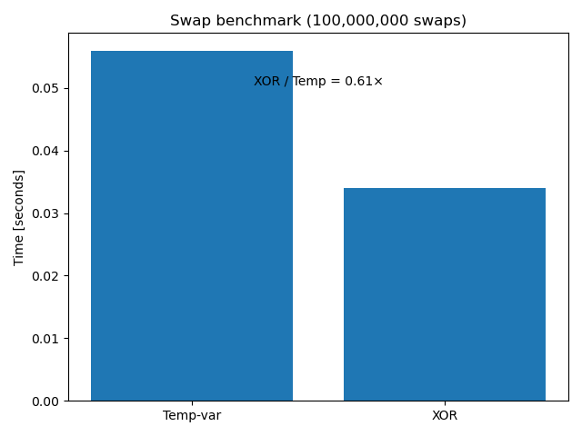

# 🧩 Binary‑Data Playground  

Tiny C++ (and a splash of Python) experiments that illustrate how **bits, bytes,
and CPU instructions** behave under the hood.

| Topic | File(s) | What it demonstrates |
|-------|---------|----------------------|
| Endianness detection | `detecting_endianness.cpp` | How to check byte order at **runtime** *and* at **compile time** (`std::endian`, compiler macros, constexpr fallback). |
| Powers of two | `powers_of_two.cpp` | A branch‑free bit‑hack to test if an integer is a power of two + unit tests with `assert`. |
| XOR vs. regular swap | `xor_vs_regular_swap.cpp` → `swap_bench` | Benchmarks the XOR‑swap trick vs. the classic temp‑var swap, logs CSV, draws a PNG chart. |
| **Crash‑dump anatomy** | `segfault_demo.cpp` | Deliberately segfaults at `0xDEADBEEF`; shows how to enable core dumps and inspect hex values in LLDB/GDB. |
| **Parsing a PNG header** | `parse_png.cpp` | Reverse‑engineers the PNG format: validates the signature, reads the `IHDR` chunk, prints width/height/bit‑depth/colour‑type. |

---

## 1  Why does this repo exist?
Modern C++ can still poke the lowest levels of computer architecture. Each
snippet focuses on a **single micro‑topic**:

* **Endianness** – why does `0x0001` sometimes sit in memory as `01 00`?  
* **Bit‑hacks** – how can one line (`x & (x ‑ 1)`) reveal a power of two?  
* **Micro‑benchmarks** – are “cool” tricks like XOR‑swap still faster on 2020‑era CPUs?  
* **Crash forensics** – reading registers & raw hex in a core dump.  
* **Binary formats** – pulling structured fields out of a PNG blob.

Together they form a lightweight **reference / playground** for students who
want to *see* what happens inside the CPU rather than just read about it.

---

## 2  Quick build & run

### 2.1  Prerequisites
* **C++17+** compiler – tested with Clang 17 & GCC 13  
  (`detecting_endianness.cpp` auto‑upgrades to C++20 for `<bit>` if available).
* **Python 3.8+** (only for the swap‑chart visualisation)  

```bash
# Conda or pip – pick one:
conda install pandas matplotlib      # easiest in a Conda env
# pip install --user pandas matplotlib
````

### 2.2  One‑liners

```bash
# Endianness probe
g++ -std=c++17 -O2 detecting_endianness.cpp -o endian
./endian

# Power‑of‑two test
g++ -std=c++17 -O2 powers_of_two.cpp -o pow2
./pow2

# XOR vs. regular swap benchmark
g++ -std=c++17 -O3 -march=native xor_vs_regular_swap.cpp -o swap_bench
./swap_bench            # default 100 M swaps
./swap_bench 20000000   # custom

python swaps.py         # draw / update swap_benchmark.png

# Crash‑dump demo (needs debug symbols, no optimisation)
g++ -g -O0 segfault_demo.cpp -o segfault_demo
ulimit -c unlimited      # macOS/Linux – enable core dumps
./segfault_demo          # crashes at 0xDEADBEEF
lldb ./segfault_demo core.*   # or gdb ./segfault_demo core

# PNG header parser
g++ -std=c++20 -O2 parse_png.cpp -o parse_png
./parse_png sample.png   # prints width, height, etc.
```

---

## 3  File overview

```
.
├─ detecting_endianness.cpp     # runtime + compile‑time endianness demo
├─ powers_of_two.cpp            # branch‑free power‑of‑two checker + tests
├─ xor_vs_regular_swap.cpp      # benchmark → ./swap_bench
├─ swap_results.csv             # CSV log
├─ swap_benchmark.png           # matplotlib chart
├─ swaps.py / plot_swaps_nopandas.py
│
├─ segfault_demo.cpp            # crashes on purpose (0xDEADBEEF) for core‑dump analysis
├─ parse_png.cpp                # minimal PNG header parser (IHDR)
│
└─ .github / CMake / …          # misc tooling
```

---

## 4  Sample output

```
$ ./segfault_demo
About to dereference 0xdeadbeef
zsh: segmentation fault  ./segfault_demo

$ lldb ./segfault_demo core.12345
(lldb) register read
...
rip = 0x00000000deadbeef   ## bad pointer visible in hex
(lldb) memory read $sp
...
```

```
$ ./parse_png swap_benchmark.png
PNG signature OK
Width       : 640
Height      : 480
Bit‑depth   : 8
Colour type : 6
```

```
$ ./swap_bench 50000000
Swaps performed       : 50000000
Temp‑var swap time    : 0.09 s
XOR     swap time     : 0.31 s
XOR / Temp‑var ratio  : 3.44
```

…and the bar chart updates automatically:



---

Happy poking at the bits! 🎉